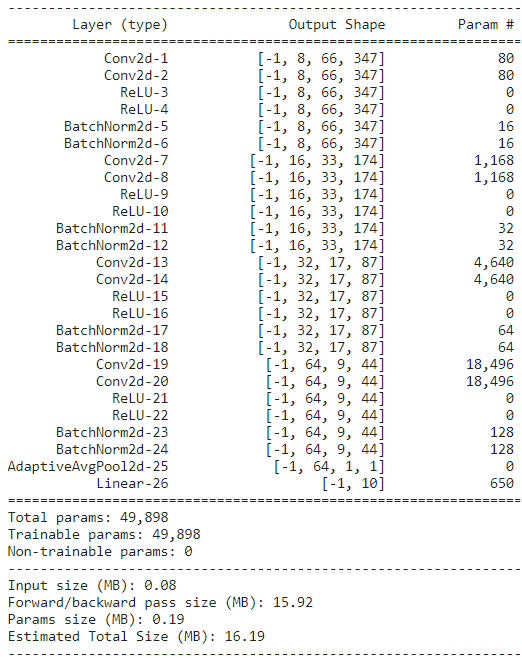

# Audio-Classification-using-Deep-Learning
The objective of this project was to classify environmental sounds from the UrbanSounds8K dataset into 10 categories - air_conditioner, car_horn, children_playing, dog_bark, drilling, enginge_idling, gun_shot, jackhammer, siren, and street_music.  
## Dataset
Download UrbanSounds8K dataset from kaggle : https://www.kaggle.com/datasets/chrisfilo/urbansound8k
## How to run this code 
Arguments : <br> 
* annotations path
* data path
* trans_type (mel_spec for mel spectrogram and gamma for gammatonegram)
* epochs (number of epochs) <br> 

Example : 
```python train.py --annotations {path to UrbanSound8K.csv} --data {path to urbansound8k} --trans_type mel_spec --epochs 25 ```
<br> 
```python train.py --annotations {path to UrbanSound8K.csv} --data {path to urbansound8k} --trans_type gamma --epochs 25 ```
## Preprocessing 
Log mel spectrograms of raw audio files were obtained using the following preprocessing steps.

## Visualizing Raw Data Waveforms

## Visualizing Processed log Mel Spectrograms of Waveforms 

## Model
Out of total 8732 samples, 5589 samples were used for training, 1397 samples were used for validation and 1746 samples were used for testing. 
After every epoch, train accuracy and validation accuracy was calculated. This was done to improve generalization of the model. After training for 25 epochs, the model was tested using the test set. 
<br>A CNN model was used to classify environmental sounds using the log mel spectrograms. 

## Evaluation Metrics Used 
Accuracy was used to evaluate the model as the data was balanced. 
## Results 
### Train-Val Loss Curves

### Confusion Matrix

## Discussion
To improve the current model, I would like to explore the following methods. 
1. Using a ResNet architecture (for example, Auditory Cortex ResNet model) as it is less prone to overfitting
2. Using LSTM-RNN as it can capture sequential time frequency relations 


